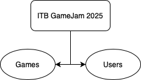

# T1. PR2. API REST - Álvaro Cobo

## Descripció del Projecte

Aquest projecte consisteix en una aplicació web completa desenvolupada amb tecnologies .NET, que inclou una API REST i un client que consumeix aquesta API. El projecte està dissenyat per gestionar un catàleg de videojocs, permetre als usuaris registrar-se, iniciar sessió, valorar els jocs i comunicar-se mitjançant un xat.

## Estructura del Projecte

### Projecte API

L'API REST està construïda amb ASP.NET Core i proporciona diversos endpoints per gestionar:
- **Autenticació d'usuaris**: Registre, inici de sessió i gestió de rols (usuari normal i administrador)
- **Gestió de videojocs**: Llistar, obtenir detalls, afegir, modificar i eliminar jocs
- **Sistema de votació**: Permet als usuaris registrats votar els seus jocs preferits

La API utilitza:
- Entity Framework Core per a la persistència de dades
- JWT (JSON Web Tokens) per a l'autenticació i autorització d'usuaris
- SignalR per a la comunicació en temps real

#### Arquitectura i Controladors API

L'API segueix una arquitectura RESTful i està organitzada en els següents controladors principals:

- **AuthController**: Gestiona tota la lògica d'autenticació i autorització:
  - `POST /api/auth/register`: Registre d'usuaris normals
  - `POST /api/auth/admin/register`: Registre d'usuaris amb rol d'administrador
  - `POST /api/auth/login`: Validació de credencials i generació de tokens JWT

- **GamesController**: Ofereix totes les operacions CRUD per als videojocs:
  - `GET /api/games`: Retorna tots els jocs disponibles
  - `GET /api/games/{id}`: Obté les dades d'un joc específic
  - `POST /api/games`: Crea un nou joc (requereix rol d'administrador)
  - `PUT /api/games/{id}`: Actualitza les dades d'un joc (requereix rol d'administrador)
  - `DELETE /api/games`: Elimina un joc (requereix rol d'administrador)
  - `POST /api/games/vote`: Permet a un usuari votar o desvotar un joc (requereix autenticació)

#### Seguretat i Validació

L'API implementa un sistema robust de seguretat:

- **JWT Authentication**: Tots els endpoints protegits requereixen un token JWT vàlid
- **Role-Based Authorization**: Certes operacions només estan disponibles per a usuaris amb el rol adequat
- **Identity Framework**: S'utilitza ASP.NET Identity per gestionar usuaris, contrasenyes i rols
- **Password Validation**: Implementa regles de validació de contrasenyes (longitud mínima, requeriments de complexitat)

#### Models i Relacions

La base de dades de l'API està estructurada amb les següents entitats principals:

- **User**: Estén la classe IdentityUser d'ASP.NET Identity i afegeix:
  - Propietats personalitzades com `Name`
  - Relació molts-a-molts amb els jocs valorats (`RatedGames`)

- **Game**: Representa cada videojoc amb:
  - Propietats bàsiques com `Title`, `Description`, `DeveloperTeam` i `ImageUrl`
  - Relació molts-a-molts amb els usuaris que han valorat el joc (`RatedUsers`)

### Diagrama de la Base de Dades

L'estructura de la base de dades utilitza Entity Framework Core per gestionar les relacions entre entitats:

- **Taules principals creades manualment**:
  - **Games**: Emmagatzema informació sobre els videojocs (Id, Title, Description, DeveloperTeam, ImageUrl)
  - **Users**: Estén AspNetUsers d'Identity Framework i afegeix propietats personalitzades (Name)

- **Relació Molts-a-Molts**:
  - Entre `Users` i `Games` hi ha una relació molts-a-molts (un usuari pot valorar molts jocs, i un joc pot ser valorat per molts usuaris)
  - Entity Framework crea automàticament una taula d'unió (join table) per gestionar aquesta relació
  - Aquesta taula intermèdia conté parells de claus foranes que vinculen usuaris i jocs

- **Taules generades per ASP.NET Identity**:
  - AspNetRoles, AspNetUserRoles, AspNetUserClaims, etc. - per gestionar l'autenticació i l'autorització basada en rols

Aquest enfocament permet una gran flexibilitat en les consultes i relacions, mentre Entity Framework s'encarrega de la complexitat de gestionar les taules intermèdies i les relacions.a

### Projecte Client

El client està desenvolupat amb ASP.NET Core utilitzant el patró Razor Pages i ofereix una interfície d'usuari per:
- Registrar-se i iniciar sessió
- Visualitzar el catàleg de jocs
- Veure detalls de cada joc
- Votar els jocs (si l'usuari està autenticat)
- Xatejar amb altres usuaris en temps real
- Gestionar els jocs (crear, modificar, eliminar) si l'usuari té rol d'administrador

#### Serveis del Client

El projecte client implementa un patró de disseny centralitzat per gestionar les comunicacions amb l'API:

- **AuthService**: Centralitza tota la lògica d'autenticació, gestionant:
  - Login d'usuaris enviant credencials a l'API
  - Processament i emmagatzematge de tokens JWT
  - Conversió dels JWT claims a cookies d'autenticació del client
  - Gestió del tancament de sessió

- **GameService**: Facilita totes les operacions relacionades amb videojocs:
  - Obtenció del llistat de jocs des de l'API
  - Consulta de detalls de jocs individuals
  - Gestió de vots als jocs
  - Tractament d'errors en la comunicació amb l'API

- **AuthenticationDelegatingHandler**: Interceptor que afegeix automàticament el token JWT a totes les peticions HTTP, permetent l'accés a recursos protegits sense necessitat de gestionar la lògica d'autenticació en cada petició.

Aquesta arquitectura de serveis permet una separació clara de responsabilitats i facilita el manteniment i l'extensió de l'aplicació.

## Tecnologies Utilitzades

- **Backend**: ASP.NET Core, Entity Framework Core, SignalR
- **Frontend**: Razor Pages, Bootstrap
- **Seguretat**: JWT, Identity Framework
- **Base de dades**: SQL Server

Aquest projecte demostra la implementació d'una arquitectura client-servidor completa amb autenticació, autorització i comunicació en temps real.